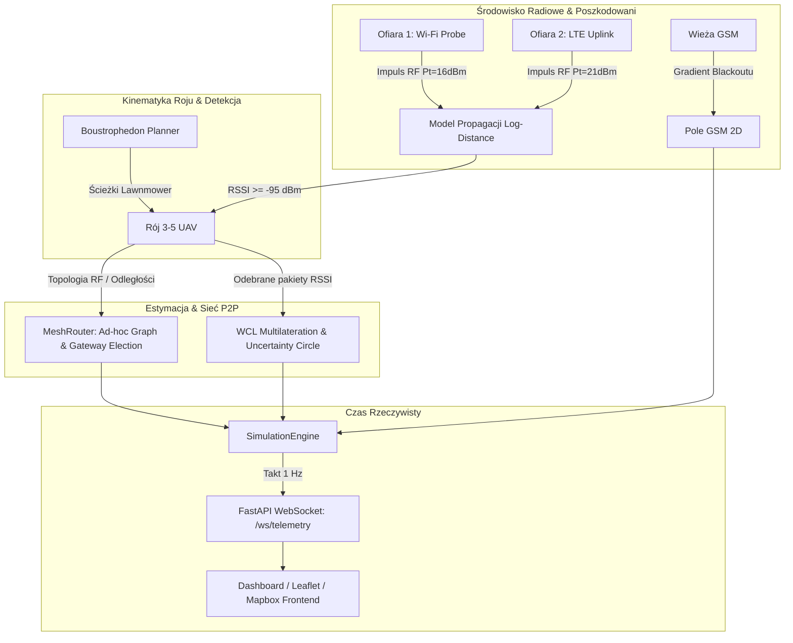

# OutOfBlack // Tactical Backend

> **Dual-Use Swarm RF Reconnaissance & Crisis Management System**  
> _Pasywne rozpoznanie radiowe oparte na roju dronów połączonych w sieć P2P Mesh w strefach blackoutu._

---

## 🚀 Szybki start (One-Command Launch)

### 1. Aktywacja środowiska i instalacja zależności

```bash
cd Backend
source .venv/bin/activate  # lub utwórz nowe: python3 -m venv .venv && source .venv/bin/activate
pip install -r requirements.txt
```

### 2. Uruchomienie serwera

Możesz uruchomić backend dowolną z poniższych komend:

```bash
python main.py
```

_lub:_

```bash
python app.py
```

_lub uvicorn bezpośrednio:_

```bash
uvicorn main:app --reload --host 0.0.0.0 --port 8000
```

Po uruchomieniu:

- 📖 **Dokumentacja OpenAPI (Swagger UI):** [http://localhost:8000/docs](http://localhost:8000/docs)
- ⚡ **Strumień WebSocket:** `ws://localhost:8000/ws/telemetry` (częstotliwość 1 Hz).

---

## Architektura Modułów

```
Backend/
├── config.py                   # Centralny plik konfiguracji parametrów symulacji (rój, RF, Mesh, GSM, ofiary)
├── simulation_config.json      # Zserializowany plik konfiguracyjny JSON (opcja edycji w czystym JSON)
├── main.py                     # Aplikacja FastAPI, WebSocket Manager, pętla 1 Hz, REST endpoints
├── app.py                      # Skrót uruchomieniowy (alias do main:app)
├── simulation_engine.py        # Główny silnik symulacji (kinematyka, pętla zdarzeń, stan misji)
├── requirements.txt            # Zależności Python 3.11+
├── models/
│   ├── telemetry.py            # Pydantic v2: Telemetria dronów, graf Mesh, POI, GSM, Snapshot
│   └── commands.py             # Pydantic v2: BoundaryRequest, SimulationControl, InjectPOI
└── core/
    ├── coordinates.py          # Geodezja WGS84 <-> lokalny metryczny układ współrzędnych ENU
    ├── flight_planner.py       # Algorytm Boustrophedon (lawnmower) & kinetyka lotu UAV
    ├── rf_propagation.py       # Log-Distance Path Loss z cieniowaniem & gradient zaniku GSM
    ├── mesh_network.py         # Graf sieci P2P Mesh, link quality, elekcja bramy GCS
    └── estimator.py            # Multilateracja WCL, okręgi niepewności i haszowanie SHA-256
```

---

## Schemat Przepływu Danych (Data Flow)



---

## Modele Matematyczne

### 1. Geodezja: Płaska aproksymacja ENU (East-North-Up)

Przeliczanie współrzędnych GPS (WGS84) na metryczne współrzędne kartezjańskie $(x, y, z)$ względem punktu referencyjnego $(\phi_0, \lambda_0)$:
$$x = (\lambda - \lambda_0) \cdot \frac{\pi}{180} \cdot R_{earth} \cdot \cos(\phi_0)$$
$$y = (\phi - \phi_0) \cdot \frac{\pi}{180} \cdot R_{earth}$$
Pozwala to na precyzyjną kinematykę i trilaterację bez ciężkich zależności zewnętrznych.

### 2. Propagacja RF (Log-Distance Path Loss Model)

$$RSSI(d) = P_{tx} - PL_0 - 10 \cdot n \cdot \log_{10}\left(\frac{d}{d_0}\right) + \mathcal{N}(0, \sigma^2)$$

- $PL_0 = 40.0\text{ dBm}$ (tłumienie w $d_0 = 1\text{ m}$ dla pasma 2.4 GHz).
- $n = 2.8$ (wykładnik tłumienia dla gruzowiska / terenu zalesionego).
- $\sigma = 2.0\text{ dB}$ (fluktuacja cieniowania wielodrogowego / log-normal shadowing).
- Czułość odbiornika UAV: $S_{rx} = -95.0\text{ dBm}$.

Estymacja odległości z odwrócenia równania:
$$\hat{d} = 10^{\frac{P_{tx} - PL_0 - RSSI}{10n}}$$

### 3. Estymacja pozycji poszkodowanego (Weighted Centroid Localization & NLS)

Gdy drony roju przechwytują impulsy radiowe z różnych pozycji:
$$w_i = \frac{1}{\hat{d}_i^{1.8}} \cdot \frac{1}{1 + 0.05 \cdot \Delta t_i}$$
$$(x_{est}, y_{est}) = \frac{\sum w_i \cdot (x_i, y_i)}{\sum w_i}$$
Następnie estymata jest dociągana optymalizacją gradientową (Non-linear Least Squares), a promień niepewności $R_{unc}$ maleje wraz ze wzrostem liczby obserwacji oraz rozproszeniem kątowym dronów (GDOP):
$$R_{unc} = \max\left(16\text{ m}, \frac{120\text{ m}}{\sqrt{N_{obs}}} \cdot \kappa\right)$$

### 4. P2P Mesh & Gateway Election

- Drony tworzą graf nieskierowany $G=(V, E)$, gdzie krawędź powstaje gdy $D_{ij} \le R_{mesh}$.
- Stacja naziemna (GCS) ma zasięg $R_{gcs} = y\text{ m}$.
- **Elekcja Bramy:** Dron z najsilniejszym bezpośrednim łączem do GCS zostaje automatycznie wybrany jako **Primary Gateway**.
- **Wieloskokowy Routing (Multi-Hop):** Algorytm BFS weryfikuje ścieżki powrotne do GCS dla wszystkich jednostek przeszukujących.

### 5. Anonimizacja i Prywatność (Dual-Use Compliance)

Pasywnie przechwycone adresy MAC / identyfikatory IMSI nie są ujawniane w stanie jawnym. Przed zapisem i transmisją są haszowane z kryptograficzną solą:
$$\text{POI-TOKEN} = \text{SHA256}(\text{SALT} + \text{RAW\_ID})[0:8]$$

---

## 🔌 API REST i WebSocket

### WebSocket: `/ws/telemetry`

Strumieniuje co 1 sekundę pełny zrzut stanu misji w formacie JSON:

```json
{
  "timestamp": "2026-09-29T12:44:05.261Z",
  "mission_state": "RUNNING",
  "drones": [
    {
      "id": "UAV-01",
      "callsign": "Vulture-1",
      "lat": 50.0558,
      "lon": 19.9272,
      "alt_m": 50.0,
      "heading_deg": 88.4,
      "speed_mps": 12.0,
      "battery_pct": 98.4,
      "status": "SEARCHING",
      "role": "GATEWAY",
      "is_gateway": true,
      "packets_sniffed": 14
    }
  ],
  "mesh": {
    "edges": [
      {
        "source": "UAV-01",
        "target": "GCS-BASE",
        "distance_m": 312.4,
        "rssi_dbm": -68.2,
        "quality_pct": 89.2
      },
      {
        "source": "UAV-01",
        "target": "UAV-02",
        "distance_m": 240.1,
        "rssi_dbm": -62.4,
        "quality_pct": 94.1
      }
    ],
    "gateway_id": "UAV-01",
    "gcs_connected": true
  },
  "pois": [
    {
      "anonymized_id": "POI-73432623",
      "signal_type": "WIFI_PROBE_REQ",
      "est_lat": 50.06214,
      "est_lon": 19.93822,
      "uncertainty_radius_m": 24.5,
      "confidence": 0.88,
      "detections_count": 8,
      "last_rssi_dbm": -74.1
    }
  ],
  "stats": {
    "elapsed_time_sec": 74.0,
    "active_drones": 4,
    "area_covered_pct": 34.2,
    "packets_intercepted": 26,
    "pois_discovered": 3,
    "gcs_online": true
  }
}
```

### Endpointy REST:

#### Kontrola Misji i Roju

- `POST /simulation/start`: Rozpoczęcie misji roju (lub wznowienie po pauzie).
- `POST /simulation/pause`: Zawieszenie ruchu dronów i emisji radiowej.
- `POST /simulation/resume`: Wznowienie wstrzymanej misji.
- `POST /mission/abort` lub `POST /simulation/abort`: Natychmiastowe przerwanie misji i skierowanie wszystkich dronów w tryb powrotu do bazy (**Return To Base / RTL**).
- `POST /simulation/reset`: Reset parametrów, przywrócenie pozycji wyjściowych przy stacji GCS, odnowienie baterii i wyczyszczenie wykrytych POI.
- `POST /mission/swap-battery`: Wymiana rozładowanej baterii na świeży pakiet (100%) dla wylądowanych dronów (opcjonalny parametr `drone_id` lub wszystkie uziemione jednostki).
- `POST /mission/relaunch-drone`: Ponowny start obsłużonego drona z bazy GCS i powrót do realizacji korytarza poszukiwawczego.

#### Inspekcja i Śledzenie Sygnałów

- `POST /mission/inspect-poi`: Skierowanie najbliższego drona w tryb zawisu (_Hover / Inspect_) bezpośrednio nad estymowanymi współrzędnymi wybranego `poi_id`.
- `POST /mission/resume-search`: Przywrócenie trybu patrolowania Boustrophedon dla drona wykonującego inspekcję (parametr `drone_id`).
- `POST /simulation/inject-poi`: Wstrzyknięcie urządzenia ofiary w zadanym punkcie GPS (parametry: `lat`, `lon`, `signal_type`, `tx_power_dbm`, `burst_interval_sec`).
- `GET /simulation/pois`: Lista wszystkich zidentyfikowanych i zlokalizowanych sygnałów poszkodowanych.

#### Pomiary i Konfiguracja Środowiska

- `GET /simulation/state`: Aktualny snapshot stanu z telemetrią, łączami mesh i planowanymi trasami (`planned_path`).
- `POST /simulation/speed`: Ustawienie mnożnika prędkości symulacji w ciele żądania (np. `{"multiplier": 5.0}`).
- `POST /simulation/speed/{multiplier}`: Ustawienie mnożnika prędkości bezpośrednio w ścieżce URL (np. `/simulation/speed/10`).
- `GET /simulation/speed`: Odczyt aktualnego mnożnika przyspieszenia czasu.
- `GET /simulation/config`: Pobranie pełnego profilu parametrów symulacji w formacie JSON (`simulation_config.json`).
- `POST /simulation/config`: Dynamiczna aktualizacja konfiguracji (zapis do `simulation_config.json` i natychmiastowe przeładowanie parametrów roju, strefy, GSM i ofiar).
- `POST /mission/define-boundary`: Dynamiczna redefinicja wielokąta poszukiwań (GeoJSON lub Bounding Box).
- `GET /config`: Dane autoryzacyjne podkładów mapowych (CARTO / Mapbox).
- `GET /health`: Szybki check stanu zdrowia serwera i pętli symulacji.

---

## ⚙️ Konfiguracja Środowiska

Plik `.env` (wzorzec w `.env.example`) umożliwia opcjonalne zdefiniowanie kluczy dla zewnętrznych dostawców kafelków GIS:

```env
# CARTO.com API Key do podkładów wektorowych/rastrowych
CARTO_API_KEY=twoj_klucz_api

# (Opcjonalnie) własny szablon URL kafelków CARTO:
CARTO_TILE_URL=https://{s}.basemaps.cartocdn.com/dark_all/{z}/{x}/{y}{r}.png

# (Opcjonalnie) Klucz Mapbox Access Token:
MAPBOX_API_KEY=
```

### Plik `simulation_config.json`

Jest to główny punkt wymiany danych pomiędzy interfejsem graficznym (Setup Studio) a silnikiem symulacji:

- `geodetic`: Współrzędne centrum operacyjnego (domyślnie Tatry/Zakopane: lat `49.2992`, lon `19.9395`), wymiary strefy w metrach, offset stacji GCS.
- `swarm`: Liczba dronów, pułap poszukiwań, odstępy między korytarzami (`lane_spacing_m`), promień dotarcia, tempo drenażu baterii LiPo oraz próg ostrzegawczy RTL (`battery_low_threshold`).
- `rf`: Zasięg P2P mesh, zasięg stacji GCS, czułość odbiornika drona (`rx_sensitivity_dbm`), wykładnik tłumienia ścieżki $n$.
- `gsm`: Pozycje masztów BTS, promień blackoutu i siła sygnału.
- `victims`: Lista symulowanych urządzeń ofiar (adres MAC, współrzędne lokalne, typ emisji Wi-Fi / LTE, moc nadawcza).

---

## 🧪 Testy Jednostkowe i Integracyjne

Wszystkie moduły matematyczne i funkcjonalne posiadają testy `pytest`:

```bash
# Uruchomienie pełnego pakietu testów:
pytest tests/ -v

# Uruchomienie testu konkretnego modułu, np. sieci Mesh:
pytest tests/test_mesh_network.py -v
```
